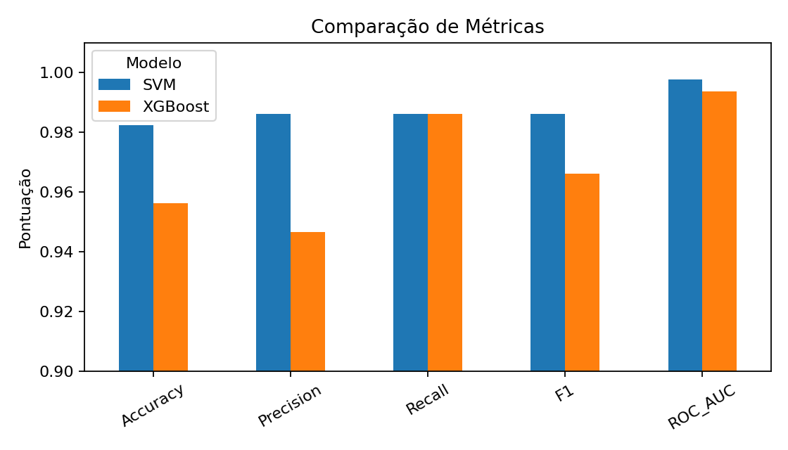
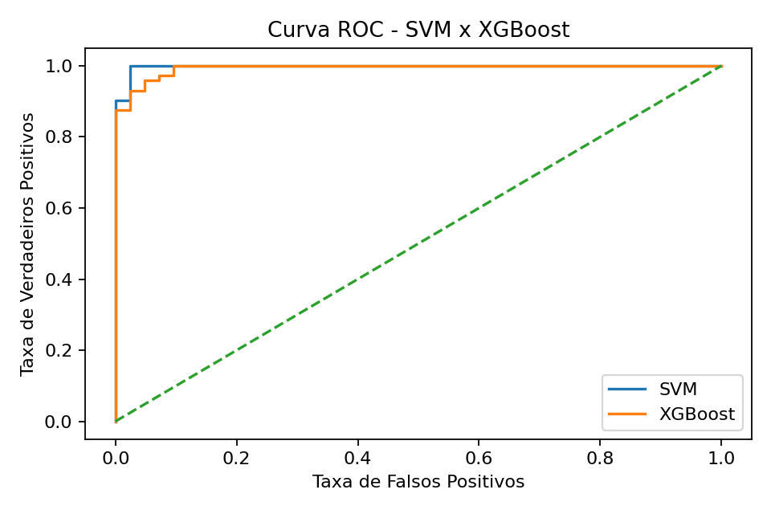

# Projeto de Parceria | Semantix — SVM x XGBoost

## Objetivo
Comparar SVM e XGBoost em um problema de classificação binária usando o Breast Cancer Wisconsin (Diagnostic) Dataset.

## Coleta de dados
Dataset público Breast Cancer Wisconsin (Diagnostic), disponibilizado pela UCI Machine Learning Repository e acessível pelo scikit-learn. São 569 amostras, 30 características numéricas e duas classes: maligno e benigno.

## Modelagem
Divisão estratificada 80/20. O SVM usa StandardScaler em Pipeline e GridSearchCV. O XGBoost é otimizado separadamente por GridSearchCV. A seleção usa validação cruzada estratificada de 5 folds e ROC-AUC.

## Resultados
| Modelo | Accuracy | Precision | Recall | F1 | ROC-AUC |
|---|---:|---:|---:|---:|---:|
| SVM | 0.9825 | 0.9861 | 0.9861 | 0.9861 | 0.9977 |
| XGBoost | 0.9561 | 0.9467 | 0.9861 | 0.9660 | 0.9937 |





## Conclusões
O SVM apresentou o melhor desempenho geral neste experimento. O XGBoost também obteve resultados elevados, mas não superou o SVM nas principais métricas. Isso mostra a importância de comparar empiricamente os algoritmos.

> Projeto acadêmico. Não utilizar como ferramenta de diagnóstico médico.

## Como executar
```bash
pip install -r requirements.txt
jupyter notebook notebooks/projeto_semantix_svm_xgboost.ipynb
```
